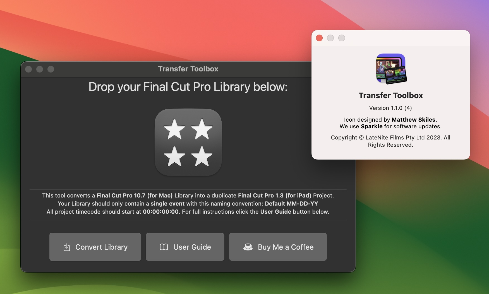

# Transfer Toolbox

Transfer Toolbox allows you to convert **Final Cut Pro 10.7.1 (for Mac) Libraries** into **Final Cut Pro 1.3 (for iPad) Projects**!

> [:icon-desktop-download: Download for **free** here...](/download/)

!!!success
MASSIVE thank you to the **107 beta testers** on Apple's TestFlight for all their support and positive feedback!

Transfer Toolbox has since been downloaded over **559** times!
!!!

You can now easily get from your Mac to your iPad!

Simply drag your existing Final Cut Pro Library into Transfer Toolbox, and a new iPad friendly Project will be created.

You can learn how to use [here](/how-to-use/).