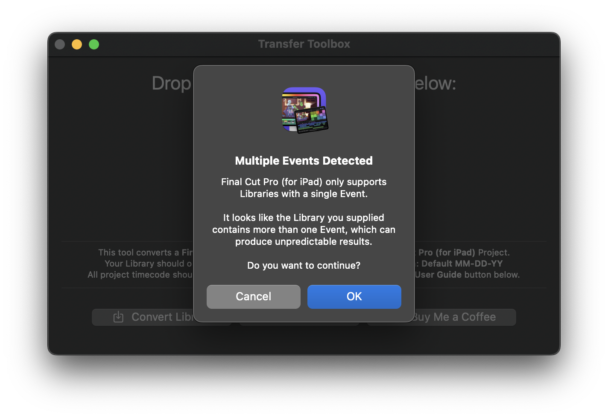
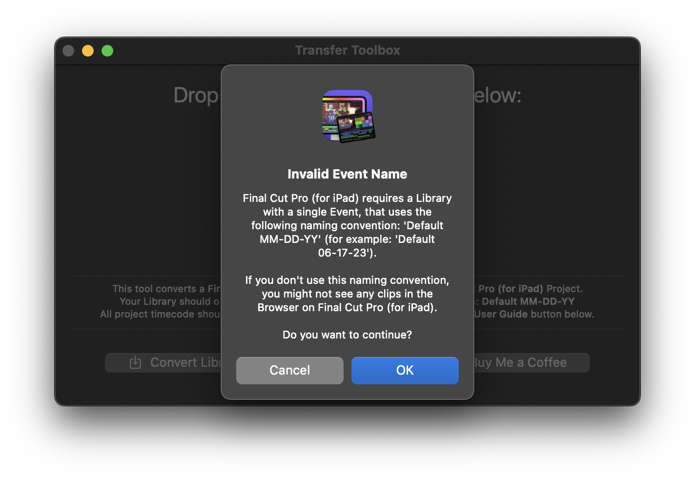
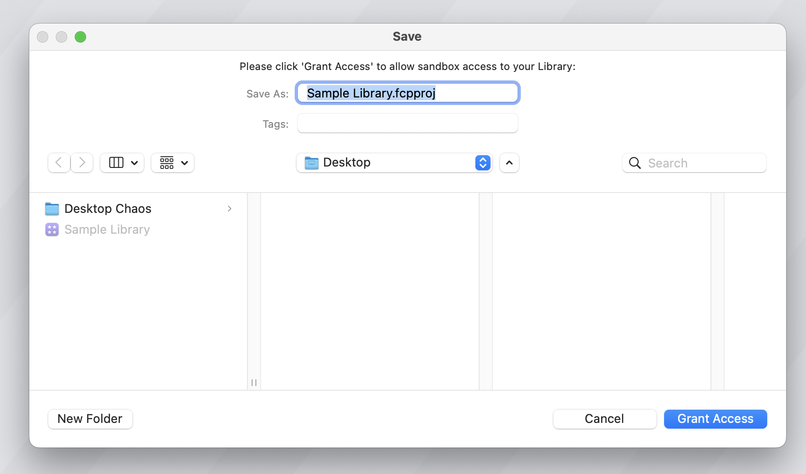
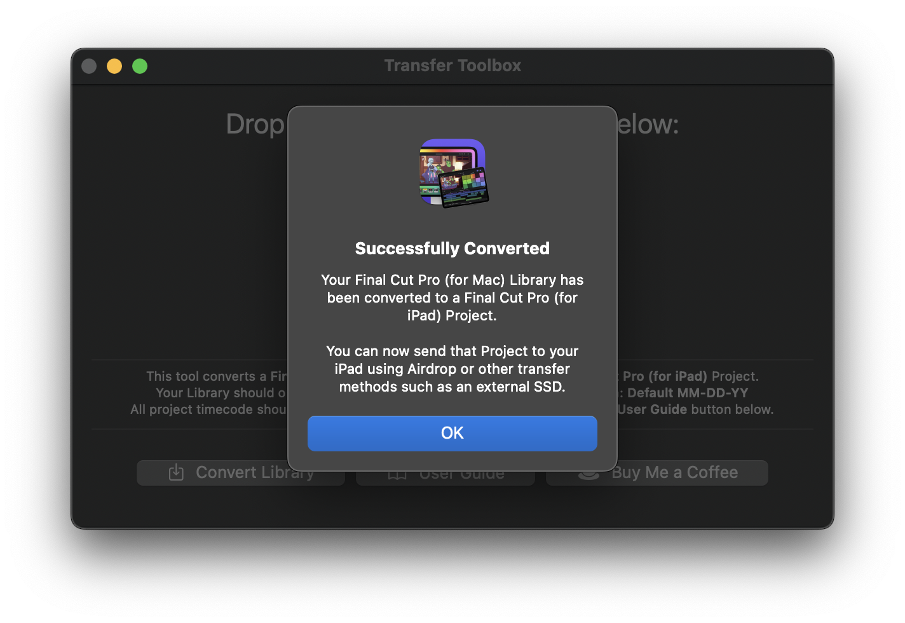
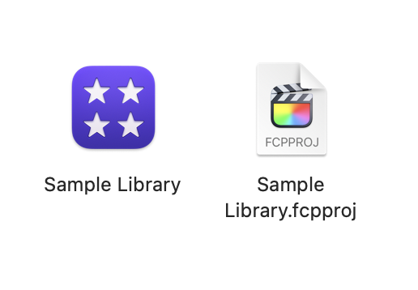
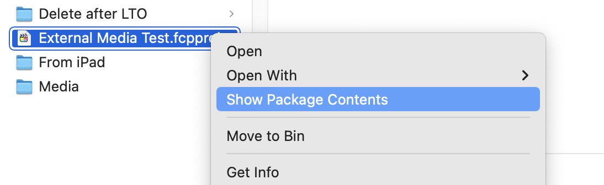
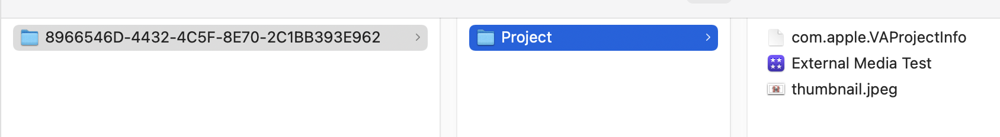
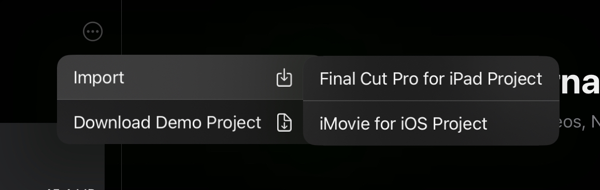
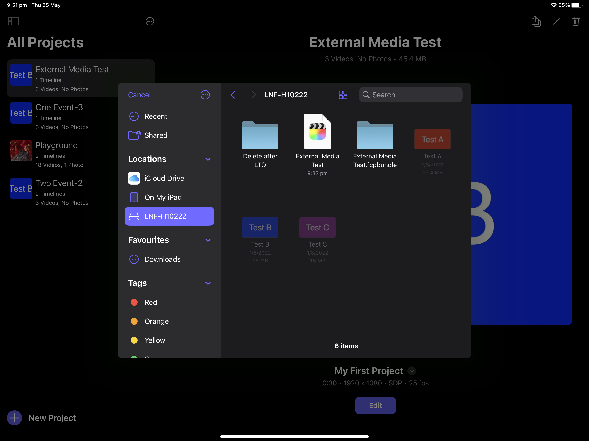

# How To Use

---

!!!danger Important
Final Cut Pro for iPad is obviously brand new, so there are a bunch of **known issues and limitations**. 
Please read this **entire page** carefully, and do **workflow tests** before using on a proper job. 
We've been using Transfer Toolbox at [LateNite](https://latenitefilms.com){target="_blank"} since it's release, and it's been awesome.
!!!

---

## Introduction

Your **Final Cut Pro (for Mac) Library** should contain a **single Event** with the following naming convention: **Default MM-DD-YY** (i.e **Default 05-31-23**).

Simply drag-and-drop your **Final Cut Pro (for Mac) library** onto the Library icon drop zone:

If you drag in a **Final Cut Pro (for Mac) Library** with Multiple Events, you'll be presented with this warning:

If you drag in a **Final Cut Pro (for Mac) Library** with the wrong Event naming convention, you'll be presented with this warning:

If you've dragged in a valid **Final Cut Pro (for Mac) Library**, or you clicked **OK** to either of the above warnings, you will be presented with a Open Panel to **Grant Access** to that Library:

After clicking **Grant Access**, you'll be presented with a success message:

You'll now find a `.fcpproj` file in the same folder as your `.fcpbundle`:

You can now use [Airdrop](https://support.apple.com/en-au/HT203106#:~:text=Select%20AirDrop%20in%20the%20sidebar,recipient%20shown%20in%20the%20window.){target="_blank"}, [iCloud Drive](https://support.apple.com/en-au/guide/mac-help/mchle5a61431/mac){target="_blank"} or other means (such as putting on an external hard drive) to move the project from your Mac to your iPad.

You can now continue editing on **Final Cut Pro (for iPad)**!

However, it's **very important** you read the rest **Limitations & Known Issues** below, so that you're aware of things that don't translate properly between Mac and iPad.

---

## Video Tutorial

Serge M has done an awesome video explaining how Transfer Toolbox works on YouTube:

{target="_blank"}

---

## Limitations & Known Issues

Some very important things to keep in mind:

- Transfer Toolbox requires **Final Cut Pro 10.6.6** or later.
- Transfer Toolbox has been tested on Final Cut Pro **v1.0.0 and v1.0.1** for iPad.
- You should ensure your library only has a **single event** with the following naming convention: **Default MM-DD-YY** (i.e **Default 05-31-23**).
- Transfer Toolbox will warn you if it detects more than one event, or if you don't use the above event naming convention, but it still allows you to proceed.
- If you use a different event name, you may not see anything in your browser on the iPad.
- All project timecode should start at **00:00:00:00**.
- All Motion Content and Media should be contained within the Library (or on the [same external drive](https://transfertoolbox.io/how-to-use/#storing-media-externally)).
- Your Final Cut Pro (for Mac) timeline/project cannot have any **Stabilisation or Rolling Shutter** effects enabled. If you do, the iPad will just say **Import Failed**.
- If you have **custom fonts** on the Mac Final Cut Pro library, you should manually install them on the iPad before importing the project.
- Currently there's no way to manually install fonts on iPad - you can only install fonts via apps that contain fonts, [via the App Store](https://support.apple.com/en-au/guide/ipad/ipad952422ba/ipados){target="_blank"}.
- Not all Motion Templates will work on the iPad. For example, some Titles using the **Match Move Behaviour** don't appear correctly on Final Cut Pro (for iPad) - the positions are all wrong.
- **FxPlug4** effects (such as [BRAW Toolbox](https://brawtoolbox.io){target="_blank"}) will not work at all on the iPad. Whilst Final Cut Pro (for iPad) does seem to have FxPlug4 Frameworks, there's currently no mechanism for third party to add FxPlug4 to iPad.
- Final Cut Pro (for iPad) will always **ignore proxy files** - it will always use the Original high-quality media files.
- **Soundtracks** will come across from iPad to Mac. However, they're not "normal" audio clips, and won't appear if you export a FCPXML. This bug has been [reported to Apple](https://github.com/CommandPost/FCPCafe/issues/94){target="_blank"}.
- Some users have reported that when you AirDrop from Mac to iPad, it can take a few minutes for the project to appear in Final Cut Pro for iPad. We haven't been able to reproduce this on a 12.9inch iPad Pro, so it may be hardware dependant. Basically... be patient if using "older" devices.
- **Compound Clips** will come across correctly, however you cannot modify them in Final Cut Pro for iPad.
- **Multicam Clips** with more than 4 angles will come across correctly, however you still only have access to the first 4 angles in Final Cut Pro for iPad.
- The **Flow** transition does work correctly between Mac and iPad, however, interestingly, the rendering results can be visually different between platforms. Mac seems better quality than iPad.

If you find any other issues or limitations, [please let us know](https://transfertoolbox.io/support/).

---

## Danger using External Drives on iPad

The fact that you can just plug in an external drive into an iPad Pro via USB-C is awesome and amazing!

However, for whatever strange reason, Apple decided not to include an **Eject** button in the **Files** app.

We've now seen cases where if you "pull the plug" on an [macOS Extended or HFS+](https://en.wikipedia.org/wiki/HFS_Plus){target="_blank"} formatted external drive, whilst the iPad is still working on it, it can corrupt the the HFS+ partition.

We haven't seen it happen first hand yet, however we suspect the same issue would happen on [APFS](https://en.wikipedia.org/wiki/Apple_File_System){target="_blank"} formatted drives.

Once corrupted, the drive no longer appears on iPad.

What's **worse** is that once the external drive is corrupt, as soon as you plug it into an Apple Silicon or Intel Mac, it will just crash the system straight away. An instant and fatal kernel panic.

The only way we've been able to fix the corrupt drives is to use a Windows PC, and use [HFS+ for Windows by Paragon Software](https://www.paragon-software.com/home/hfs-windows/){target="_blank"} to mount and repair the drive.

Once repaired on Windows, it works fine again on macOS and iPad.

Given this, it's our **strong recommendation** that if you're using an external drives on iPad, that before you "pull the plug" you "force quit" all applications or better yet, [shutdown the iPad](https://support.apple.com/en-au/guide/ipad/ipad63d30b5a/ipados){target="_blank"} whenever ejecting drives.

You can force quit application on the iPad, by tapping the bottom of the screen and dragging up to the middle, then stopping. This opens the **App Switcher**. You can then swipe up on an app to force quit it.

If you're external drive has an LED status light, that's another good way to determine if the iPad is still doing "stuff" with it.

---

## Storing Media on iCloud

It is possible to store your media on iCloud Drive and effectively "share it" between your Mac and your iPad.

When you import media into Final Cut Pro for iPad it will **always** copy to the library.

However, because iPad's use [Apple File System (APFS)](https://support.apple.com/en-au/guide/disk-utility/dsku19ed921c/mac){target="_blank"} for their internal storage, even thought it's **copying** the files from the iCloud drive cache to the Final Cut Pro library, it doesn't actually take up any more "physical" drive space.

When you duplicate a file in APFS, rather than immediately making a complete second copy of the file, the file system essentially just creates a new reference, or pointer, to the existing data. This means that, the duplicate file doesn't take up any extra space because it's just pointing to the same underlying data as the original file.

When sending your project from Final Cut Pro on iPad back to your Mac, just export with the **Include All Media** option disabled, and then manually relink to your iCloud Drive files within Final Cut Pro on Mac.

---

## Storing Media Externally

!!!danger Important
Unfortunately, whilst this worked on **Final Cut Pro v1.0.0**, Apple has removed support for this workflow in **Final Cut Pro v1.0.1**. 
We are still testing and exploring other possibilities and workarounds for "linking to" external media.
!!!

Interestingly, it is actually possible to "link" to media on an external hard drive.

However, even though Final Cut Pro (for iPad) will "link" to the external drive initially, and when you first start editing, you'll be editing off the external drive - in the background, Final Cut Pro will start copying everything across to the internal drive.

As far as we can tell, there's currently no way to stop Final Cut Pro from importing the footage to your iPad's internal drive.

This works slightly differently to DaVinci Resolve (for iPad) and LumaFusion, which both support "linking" to external drives without having a local/internal copy.

With that in mind, if you still want to "link" to your media initially, you'll need to create the Final Cut Pro library on macOS, and make sure you keep the media **external** to the library.

As long as both the generated Final Cut Pro (for iPad) project and media are on the same external hard drive, in the same location as they were on the Mac, everything will work.

The reason for this is that internally Final Cut Pro (for Mac) created document-scope security-scoped bookmarks to each media file, which Final Cut Pro (for iPad) can also use to get access to the files, even in a sandboxed environment.

After creating a new Final Cut Pro (for iPad) project using Transfer Toolbox, you may need to open the library back up on the Mac, to update all the bookmarks.

Simply right-click on the new Final Cut Pro (for iPad) project in Finder and select **Show Package Contents**.

Within the package contents, two folders deep, you'll find the Final Cut Pro (for Mac) library that you can now open on your Mac.

Once you open it, and allow Background Tasks to complete, you can then close it, as the document-scope security-scoped bookmarks should now be updated.

We will investigate automating this process in a future update.

You can then import Final Cut Pro (for iPad) libraries via the home screen:

Just select the project on your external drive:

---

## Supported Media

Below is a list of Supported Media in Final Cut Pro for iPad:

### Video Formats

- Apple ProRes
- Apple ProRes RAW and Apple ProRes RAW HQ
- H.264
- HEVC
- MXF (Apple ProRes)

### Audio Formats

- AAC
- AIFF
- BWF
- CAF
- MP3
- MP4
- WAV

### Stills Formats

- Apple ProRAW
- BMP
- GIF
- HEIF
- JPEG
- PNG
- PSD
- RAW
- TGA
- TIFF

You can also find this information on [Apple's website](https://support.apple.com/en-au/guide/final-cut-pro-ipad/dev3f1bb94c2/ipados){target="_blank"}.

---

## Camera Formats

Final Cut Pro for iPad supports a wide range of third-party digital video and still cameras.

You can see the full list on [Apple's website](https://support.apple.com/en-au/HT213668){target="_blank"}.